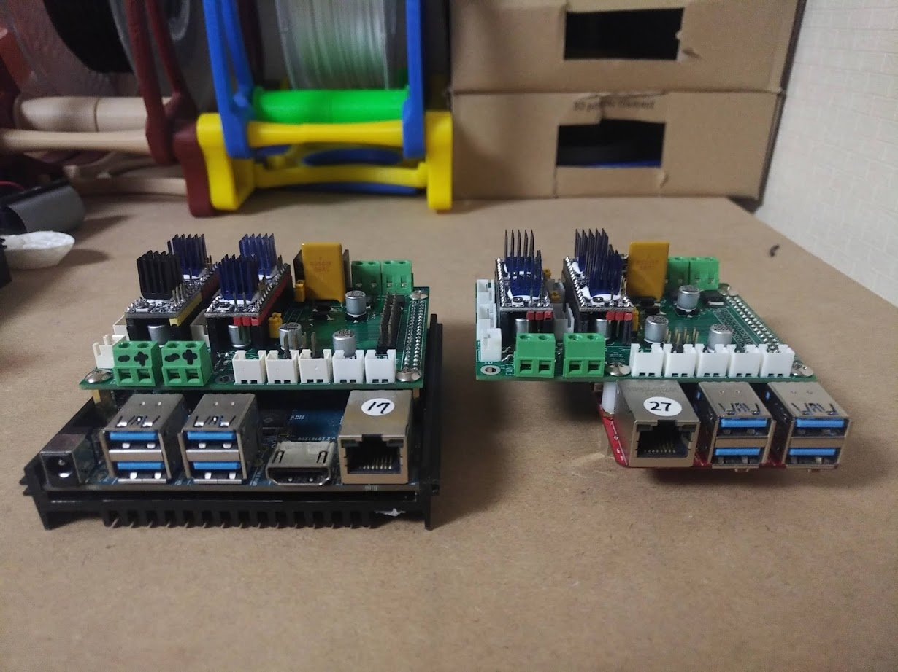

## 3D Printer Shield 

"3D Printer Shield" is a board to run 3D printer using ODROID single board
computer, technically this board is designed to control the motor driver
modules with TMC2209 (UART) or TMC2130 (SPI) through the on-board GPIO
headers without an additional processessor.

Originally this project is started to use RAMPS 1.6, but has changed to design
a new board since board connection is quite different.

The board has been tested with Ender-3 and runs by Klipper.

Then later, I've built an OS image to run Klipper on ODROID-C4 and the image
can be downloaded from [the link](https://bit.ly/3ppd9lL)

